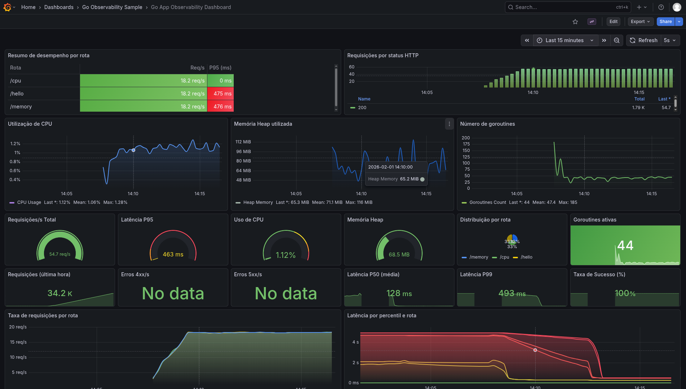
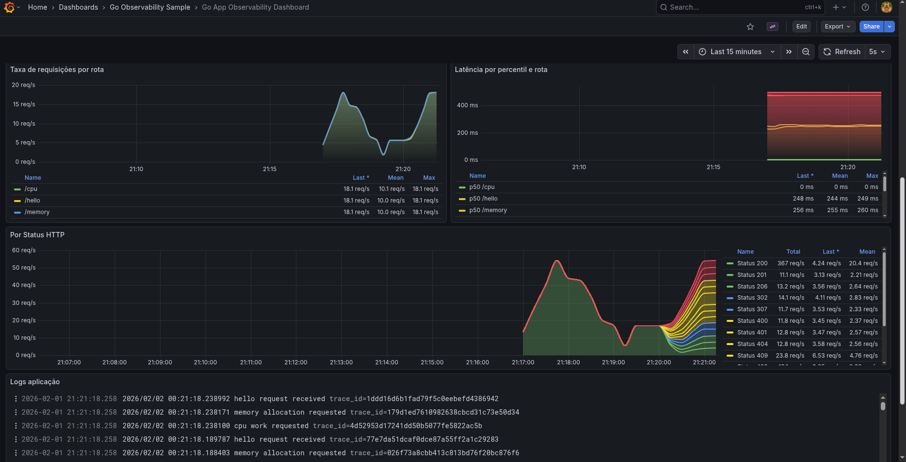

# Go Telemetry And Observability Sample

A small Go web service that demonstrates end-to-end observability and telemetry collection with OpenTelemetry (traces + metrics) and a log pipeline to Grafana Loki. The app exposes a few endpoints that simulate latency, CPU, and memory pressure, and publishes Prometheus metrics while exporting traces via OTLP.

## What this repo includes

- **Go HTTP service** with `/hello`, `/cpu`, and `/memory` endpoints.
- **OpenTelemetry tracing** exported via OTLP gRPC.
- **Prometheus metrics** exposed at `/metrics` and scraped by Prometheus.
- **Grafana + Loki** for dashboards and logs.
- **Jaeger** for trace visualization.
- **Load generator** script using Vegeta.

## Sample views




## Architecture (local dev stack)

- App: `localhost:8080`
- Metrics endpoint: `localhost:9464/metrics`
- Jaeger UI: `http://localhost:16686`
- Prometheus UI: `http://localhost:9090`
- Grafana UI: `http://localhost:3000`

## Quick start (local Go)

1) Run the app:

```bash
make run
```

2) Hit an endpoint:

```bash
curl http://localhost:8080/hello
```

3) Check metrics:

```bash
curl http://localhost:9464/metrics
```

## Full observability stack (Docker Compose)

This brings up Jaeger, Prometheus, Grafana, Loki, Promtail, and the Go app.

```bash
docker compose -f docker-compose.dev.yml up --build
```

Then open:

- Grafana: `http://localhost:3000` (user/pass from `.env.dev`)
- Jaeger: `http://localhost:16686`
- Prometheus: `http://localhost:9090`

Grafana is pre-provisioned with Prometheus, Loki, and Jaeger datasources plus a sample dashboard.

## Configuration

Environment variables used by the app:

- `OTEL_SERVICE_NAME` (default: `go-telemetry-app`)
- `SERVICE_VERSION` (default: `dev`)
- `APP_ENV` (default: `local`)
- `OTEL_EXPORTER_OTLP_ENDPOINT` (default: `localhost:4317`)
- `OTEL_EXPORTER_OTLP_INSECURE` (default: `true`)
- `LOGGING_PATH` (default: `logs`)
- `SIMULATE_STATUS_CODES` (default: `true`)

When using Docker Compose, `.env.dev` sets `LOGGING_PATH=.docker/logs` so Promtail can read the log file.

## Endpoints

- `GET /`
  - Returns a list of available endpoints.
- `GET /hello`
  - Adds random latency and returns a hello message.
- `GET /cpu`
  - Burns CPU for a random duration.
- `GET /memory`
  - Allocates ~5MB per request and keeps a small rolling window.

## Metrics

The app exposes Prometheus metrics at `:9464/metrics`, including:

- `http_server_requests_total`
- `http_server_request_duration_ms`
- `process_memory_heap_bytes`
- `process_goroutines`
- `process_cpu_percent`

Metrics are labeled with `http.route`, `http.method`, and `http.status_code`.

## Traces

Traces are emitted via OTLP gRPC and use W3C Trace Context propagation. The `otelhttp` middleware wraps handlers, and trace IDs are also printed in logs for easy correlation.

## Logs

Application logs are written to both stdout and a file at `${LOGGING_PATH}/app.log`. Promtail tails this file and sends logs to Loki; Grafana is configured with a derived field to link logs to Jaeger traces by `trace_id`.

## Load testing

A simple load generator is included at `scripts/sh/test.sh`.

```bash
BASE_URL=http://localhost:8080 RATE=20 DURATION=5s SLEEP_BETWEEN=0.1 scripts/sh/test.sh
```

The script installs Vegeta automatically if Go is available.

## Project layout

- `main.go`: app bootstrap
- `pkg/telemetry`: OpenTelemetry setup (OTLP traces + Prometheus metrics)
- `internal/server`: handlers, router, and instrumentation
- `internal/metrics`: metric instruments and runtime gauges
- `internal/logging`: log file setup
- `.docker/`: Prometheus, Grafana, Loki, and Promtail configs

## Make targets

- `make run` — run the Go app
- `make test` — run the app and generate continuous traffic with Vegeta

## Troubleshooting

- If traces do not appear, verify `OTEL_EXPORTER_OTLP_ENDPOINT` and that Jaeger is running on `:4317`.
- If metrics are missing, ensure the app is running and Prometheus is scraping `golang:9464` (Docker) or `localhost:9464` (local).
- If logs are missing in Grafana, confirm `LOGGING_PATH` and that Promtail can read `${LOGGING_PATH}/app.log`.

## Contact

For support, collaboration, or questions about this project:

**Email**: [raykavin.meireles@gmail.com](mailto:raykavin.meireles@gmail.com)  
**GitHub**: [@raykavin](https://github.com/raykavin)  
**LinkedIn**: [@raykavin.dev](https://www.linkedin.com/in/raykavin-dev)  
**Instagram**: [@_raykavin](https://www.instagram.com/_raykavin)